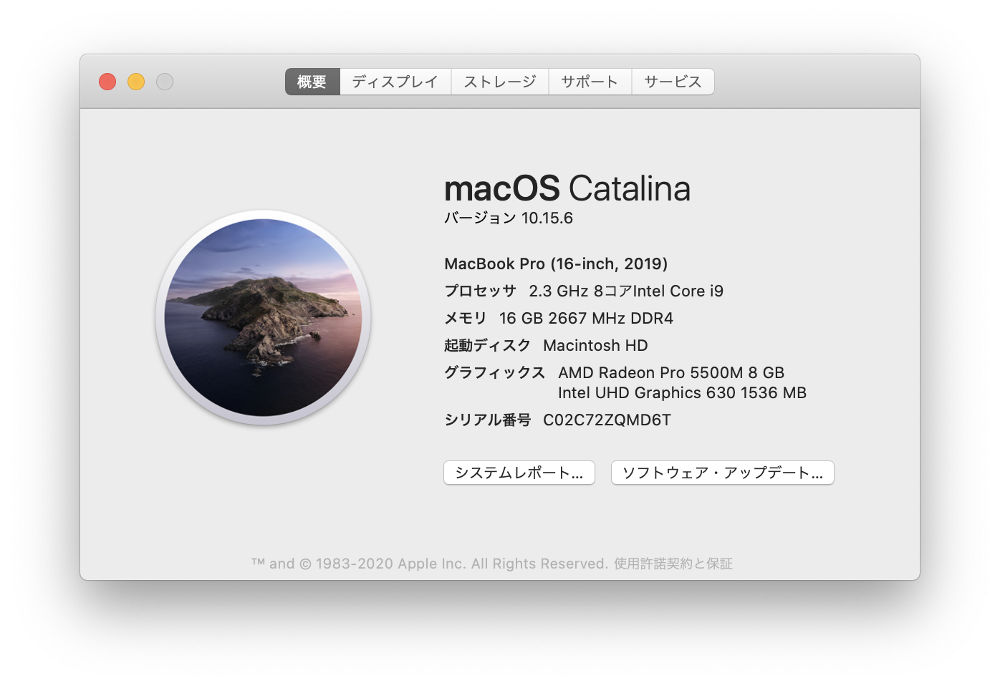
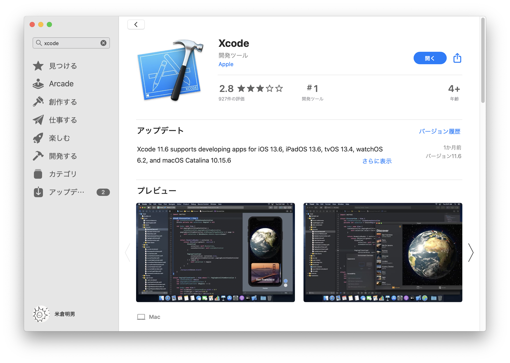
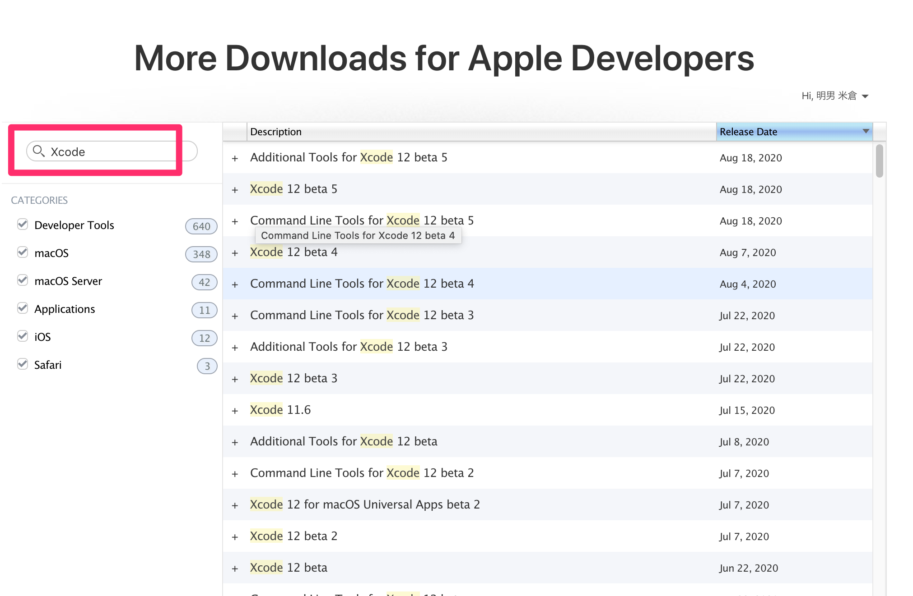
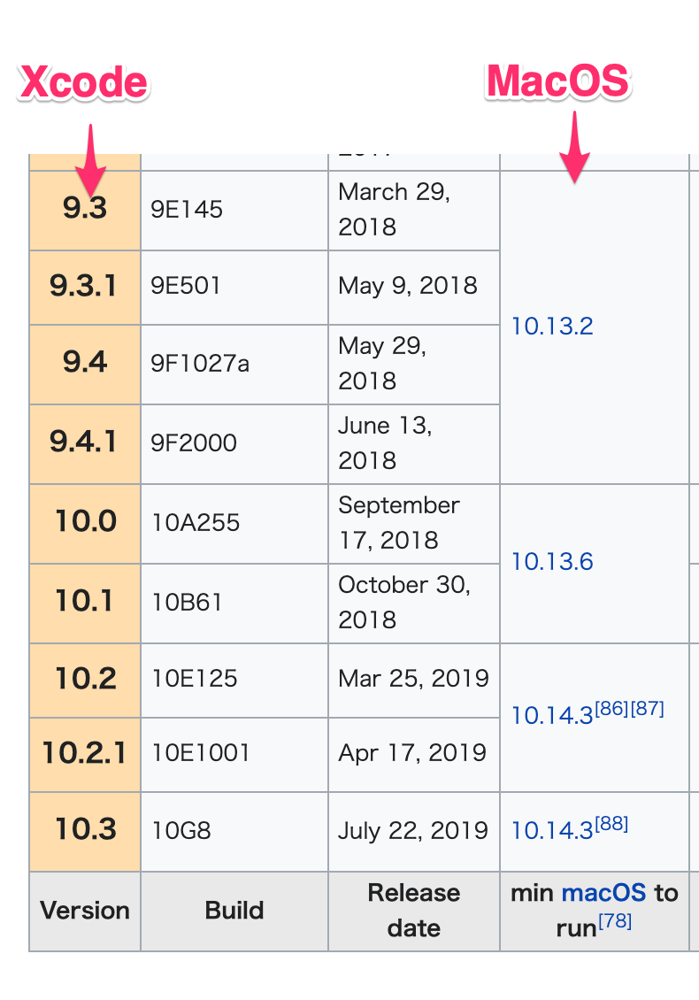
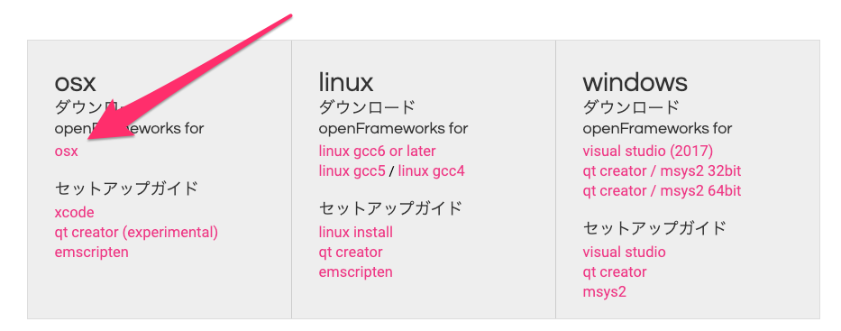

# インストール

コードを記述するエディタの`Xcode`と`openFrameworks`の2つをダウンロード・インストールする必要があります。

## 1. Xcodeのインストール

使用のMacOSのバージョンによって異なります。

&nbsp;

### MacOSバージョンの確認方法
メニューの左の`アップル`マークから、`このMacについて`

&nbsp;

### MacOS 10.14.4以降

#### App Storeよりダウンロード

[Xcodeのダウンロード](https://apps.apple.com/jp/app/xcode/id497799835?mt=12)

> 8GB程あるので、固定回線でダウロードしてください。

&nbsp;

### MacOS 10.14.4以前

Apple Developers（開発者用サイト）で旧バージョンのXcodeをダウンロードします。

[Apple Developers Download](https://developer.apple.com/download/more/)

1. Apple IDでログイン

2. 検索から`Xcode`と入力して該当のバージョンを探す

#### バージョン一覧表

&nbsp;
&nbsp;

### Xcode コマンド ライン ツール
Xcodeを起動すると「コマンド ライン ツール」のインストールが始まります。こちらも時間がかかるので授業前に済ませておいてください。

&nbsp;
&nbsp;

## 2.openFrameworksのインストール

[openFrameworks Download](https://openframeworks.cc/ja/download/)

リンクより`OSX`のリンクをクリック`of_v0.11.0_osx_release.zip`ファイルがダンロードされます。
解凍したらこちらのYoutubeを参考にExampleを実行してみてください。

[https://youtu.be/-_GyT434r8E](https://youtu.be/-_GyT434r8E)