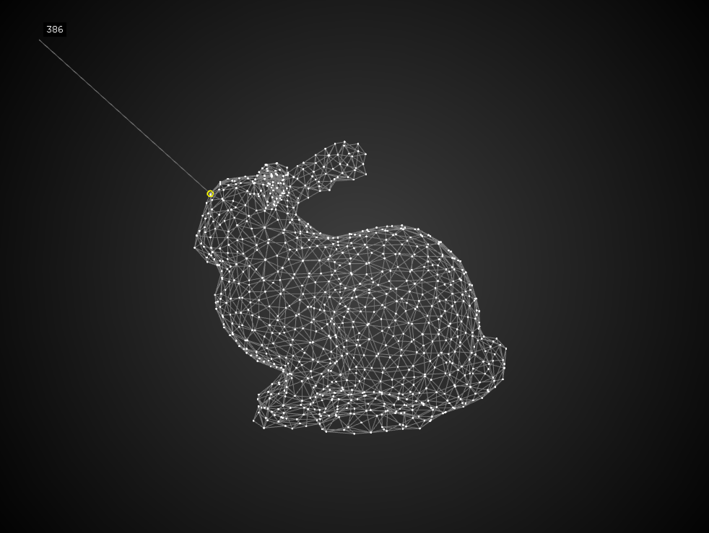
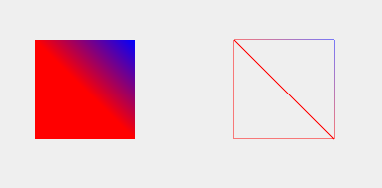

# メッシュ



## ofMesh()

3Dオブジェクトは頂点データの集まりから描画されている。

[公式サイト: ofMesh](https://openframeworks.cc/documentation/3d/ofMesh/)

参照: [ofMeshの基礎](https://qiita.com/YoshimasaSakuragi/items/2734ff24e2f6a2e5aafe)


&nbsp;

ofApp.h

```
ofMesh mesh; //変数宣言
```

ofApp.cpp

```
void ofApp::setup(){
    ofBackground(255);
    
    //頂点の座標を指定
    mesh.addVertex(ofVec3f(100,100,0));
    mesh.addVertex(ofVec3f(100,200,0));
    mesh.addVertex(ofVec3f(200,200,0));
    mesh.addVertex(ofVec3f(200,100,0));
    
    //座標のつなぎ順を指定して面にする
    mesh.addIndex(0);
    mesh.addIndex(1);
    mesh.addIndex(2);
    mesh.addIndex(0);
    mesh.addIndex(3);
    mesh.addIndex(2);
    
    //色指定
    mesh.addColor(ofFloatColor(1.0,0.0,0.0));
    mesh.addColor(ofFloatColor(1.0,0.0,0.0));
    mesh.addColor(ofFloatColor(1.0,0.0,0.0));
    mesh.addColor(ofFloatColor(0.0,0.0,1.0));
}

void ofApp::draw(){
    mesh.draw(); //面表示
    ofTranslate(200, 0); //隣に移動
    mesh.drawWireframe(); //ワイヤー表示
}

```



&nbsp;
&nbsp;


&nbsp;
&nbsp;
&nbsp;


